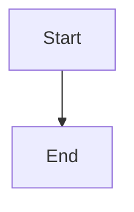

# Study materials — overview

Rich content (diagrams, tables, mermaid, **notebook scans**) lives in the **`study/`** folder in git — not in Supabase.

| What | Where | Sync |
|------|-------|------|
| Text notes | App text areas | Supabase |
| Images & markdown sheets | `study/` | Git push → GitHub Pages |

---

## Adding images & scans — start here

**[`ADDING_IMAGES.md`](./ADDING_IMAGES.md)** — complete guide with step-by-step instructions for:

1. **GS themes** — `study/themes/{themeId}/`
2. **GS questions** — `study/questions/{questionId}/`
3. **Math modules** — `study/modules/{moduleId}/` (standard results, derivations, tricks, scans)

Includes `manifest.json` formats, preview steps, troubleshooting, and the Math helper script.

### Quick links by folder

| Guide | Path |
|-------|------|
| GS themes | [`study/themes/README.md`](study/themes/README.md) |
| GS questions | [`study/questions/README.md`](study/questions/README.md) |
| Math modules | [`study/modules/README.md`](study/modules/README.md) |

---

## Folder layout

```text
study/
├── themes/{themeId}/       ← GS theme sheets (many PYQs)
├── questions/{questionId}/ ← GS single-PYQ diagrams
└── modules/{moduleId}/     ← Math optional notebook scans
    ├── standard-results/
    ├── derivations/
    ├── tricks/
    └── important-questions/
```

---

## Markdown & mermaid (no image file)

Create `README.md` in any `study/` folder. Use tables and mermaid blocks:

````markdown

````

List the file in `manifest.json`:

```json
{
  "sections": [
    { "type": "markdown", "file": "README.md", "title": "Core sheet" }
  ]
}
```

Example: `study/themes/constitution-polity/README.md`

---

## Workflow

1. Add files under `study/` + update `manifest.json`
2. Preview: `python3 -m http.server 8080` → open the theme, question, or module in the app
3. Ship: `git add study/ && git commit -m "Add scans" && git push`
4. Live site updates in ~1 minute (GitHub Pages)

---

## Tips

- **Phone** — images render in the app; add files from laptop via git
- **Large PDFs** — host on Drive and link from `README.md`
- **Don’t commit** — full copyrighted books, secrets, or huge unoptimized scans
