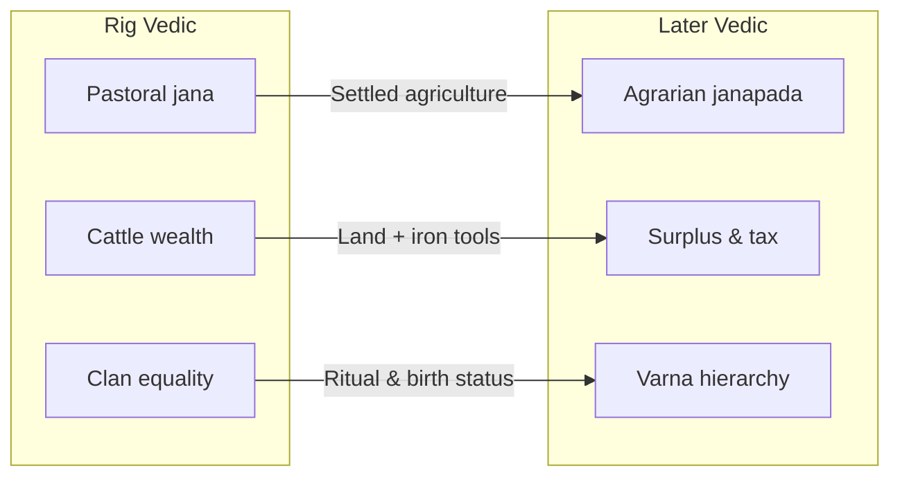

# GS I · 2024 · Q.1 — Rig Vedic → Later Vedic (Society & Economy)

**Question:** Underline the changes in the field of society and economy from the Rig Vedic to the later Vedic period.

## Answer structure (10 marks · ~150 words)

| Part | Content |
|------|---------|
| **Intro** | Rig Vedic = early pastoral phase; Later Vedic = settled agrarian, iron use, kingdoms emerging |
| **Society** | Tribal → territorial; egalitarian clan → varna hierarchy; women status declined; ashram system crystallised |
| **Economy** | Pastoral + limited agriculture → plough agriculture dominant; surplus & taxes; craft specialisation; trade routes |
| **Conclusion** | Transition marks foundation of classical Indian social order and agrarian economy |

## Society — compare

| Aspect | Rig Vedic | Later Vedic |
|--------|-----------|-------------|
| Political unit | **Jana** (tribal) | **Janapada** / early kingdoms |
| Social order | Clan-based, relatively flexible | **Varna** (Brahmin, Kshatriya, Vaishya, Shudra) rigidifying |
| Women | **Sabha & Samiti** participation; scholars (e.g. Apala, Lopamudra) | Declining public role; child marriage norms emerging |
| Family | Patriarchal but less ritual hierarchy | **Gotra** exogamy; joint family stress |
| Religion | Nature gods (Indra, Agni, Varuna) | Ritualism ↑; Prajapati; elaborate sacrifices |

## Economy — compare

| Aspect | Rig Vedic | Later Vedic |
|--------|-----------|-------------|
| Livelihood | **Pastoralism** primary; cattle = wealth (*gavishti*) | **Agriculture** primary; iron ploughshare |
| Land | Open grazing; no private property emphasis | Land rights; **King's claim on fertile land** |
| Taxation | Bali (voluntary offering) | **Bhaga, Bali, Shulka** — regular dues |
| Occupations | Limited specialisation | **Craft guilds**; potters, smiths, weavers |
| Trade | Local barter | Inter-regional exchange; **Nishka** (ornament-currency) |

## Transition flow

## Value adds

- **Geography:** Sapta Sindhu → Gangetic valley expansion  
- **Texts:** Rig Veda → Yajur/Sama/Atharva; Brahmanas & Aranyakas  
- **Iron:** Late 2nd millennium BCE — enables clearance of dense forests  

See diagram below for a one-page revision view.
