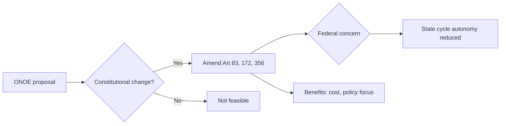

# GS II · 2024 · Q.1 — Electoral reforms & One Nation One Election

**Question:** Examine the need for electoral reforms as suggested by various committees, with particular reference to "one nation – one election" principle.

## Answer structure (15-mark style)

| Section | Points |
|---------|--------|
| Intro | Simultaneous elections historically (1952–1967) · current staggered cycle · cost & governance drag |
| Body 1 | Committee recommendations — Law Commission 170th report, Niti Aayog discussion paper, Kovind committee |
| Body 2 | ONOE model — Lok Sabha + all Assemblies sync · constitutional amendments · Art 83, 172 |
| Body 3 | Challenges — federalism, anti-defection, hung assemblies, EVM logistics, MCC |
| Conclusion | Phased approach · build consensus · pilot at local/state level first |

## Flow — decision tree for ONOE debate

## Value adds

- **Kovind High Level Committee (2024)** — implementation roadmap  
- **170th Law Commission** — simultaneous elections feasibility  
- **Shakti Singh v. Union (2024 context)** — electoral bond aftermath → transparency leg  

_Add `.png` diagrams to this folder and list them in `manifest.json`._
