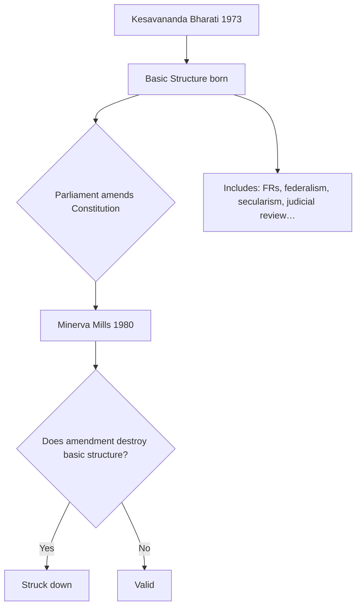

# Constitution & Polity — study sheet

Use this folder for **tables, flowcharts, and diagrams** you build in Cursor / Excalidraw / draw.io. Push to GitHub — they appear in the app automatically.

## Federal vs Unitary — quick compare

| Feature | Unitary (e.g. UK) | Federal (India) |
|---------|-------------------|-------------------|
| Written constitution | Not always | Yes (1950) |
| Division of powers | Central dominance | Union, State, Concurrent Lists |
| Supremacy | Parliament | Constitution (Basic Structure) |
| Amendability | Easier | Rigid + judicial review |

## Basic Structure doctrine — flow

## One Nation One Election — angles for PYQs

1. **Constitutional** — Art 83, 172, 356; fixed terms vs simultaneous dissolution  
2. **Federal** — state election cycle autonomy  
3. **Committee reports** — Law Commission, Niti, Ram Nath Kovind committee (2024)  
4. **Pros** — cost, policy continuity, reduced MCC paralysis  
5. **Cons** — nationalisation of local issues, logistics, constitutional amendments needed  

## Link to diagram

See the SVG below for Union–State–Concurrent lists (also editable in this folder).
